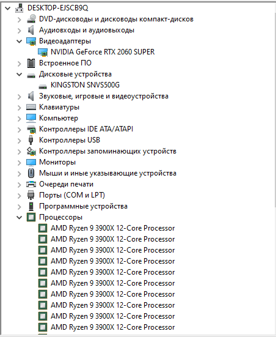
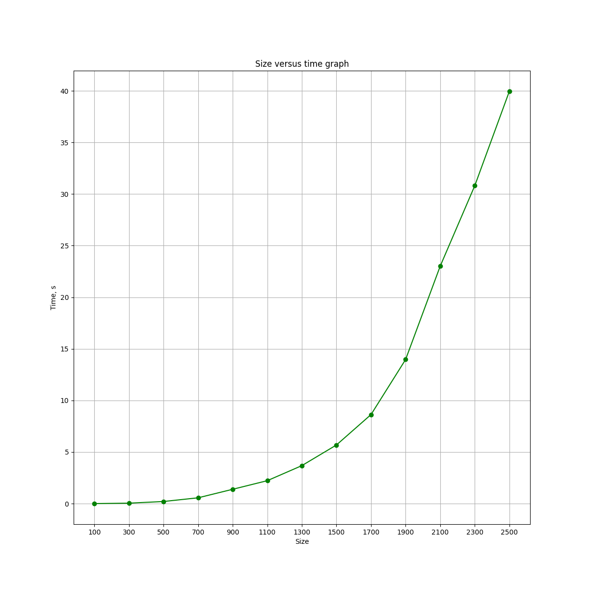
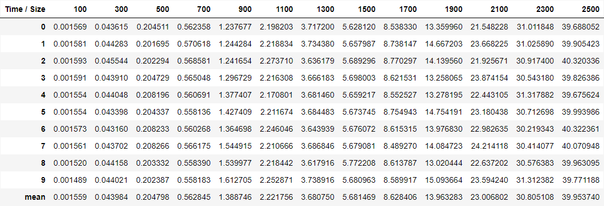

# Обзор репозитория
В репозитории находятся:

- Проект на C++, отвечающий за генерацию квадратных целочисленных матриц и их перемножения;
- Python скрипт, отвечающий за проверку полученного результата умножения, создания графика, таблицы значений;
- txt-файлы, необходимые для работы проекта на C++ и Python скрипта.
# Комплектующие компьютера
  
# Вывод
  Вывод: при увеличении размеров матриц, увеличивается время генерации и перемножения.
# Результаты
  
  
